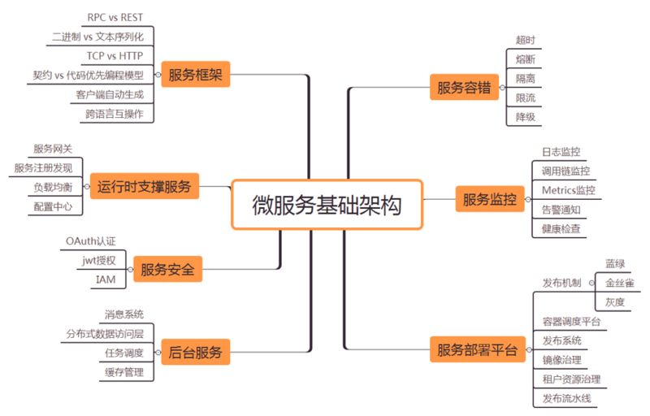

# 微服务基础框架

#### 微服务基础框架概览

### 服务框架

**go-micro**是一个插件式的RPC框架，所以其选择了RPC作为其交互方式。**micro**基于	**go-micro**开发工具集，支持HTTP与RPC的互操作，所以对外表现为HTTP,对内为RPC(内部也是支持HTTP协议的)。

详细参考 [API 网关](https://micro.mu/docs/api.html)部分 和 [example](https://github.com/feixiao/examples/tree/master/greeter)

### 运行时支撑服务

#### 配置中心

+ 参考项目

  + [config-srv](https://github.com/feixiao/config-srv)  A dynamic config service for microservices。
  + [config-web](https://github.com/feixiao/config-web)  A web app for the dynamic config service config-srv。

    上面的项目都是基于Consul实现（可以实现插件针对其他的工具进行实现）。

  + [github.com/micro/go-os/config](https://github.com/micro/go-os/tree/master/config)    **Note: This is still a work in progress**

+ 客户端的集成：目前在go-micro中并没有实现类似的功能

+ 开源的配置中心方案

  + [confd](https://github.com/kelseyhightower/confd)    go-micro如何集成？

#### 注册中心/服务注册和发现

##### 服务注册

+ Go Micro的 **registry** 包用于服务发现。后台支持consul, etcd, zookeeper, dns, gossip等等，默认使用的Consul，可以使用插件的形式支持其他后台实现。官方提供的[插件](https://github.com/micro/go-plugins/tree/master/registry)
+ go-micro的全部例子都是需要依赖注册中心，默认的实现是MDNS或者Consul。 [example/service](https://github.com/feixiao/examples/tree/master/service)

##### 服务发现

+ ​

#### 服务网关

#### 负载均衡

